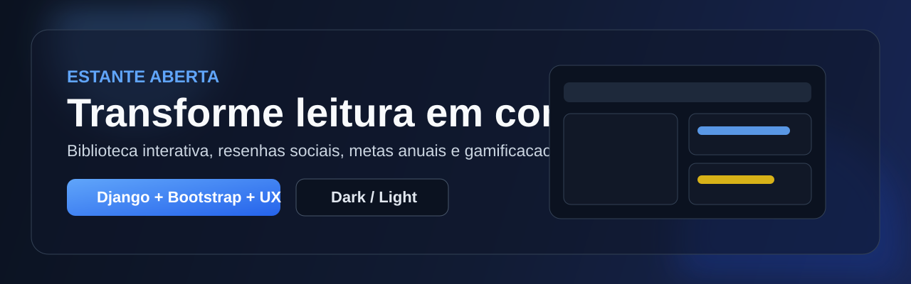
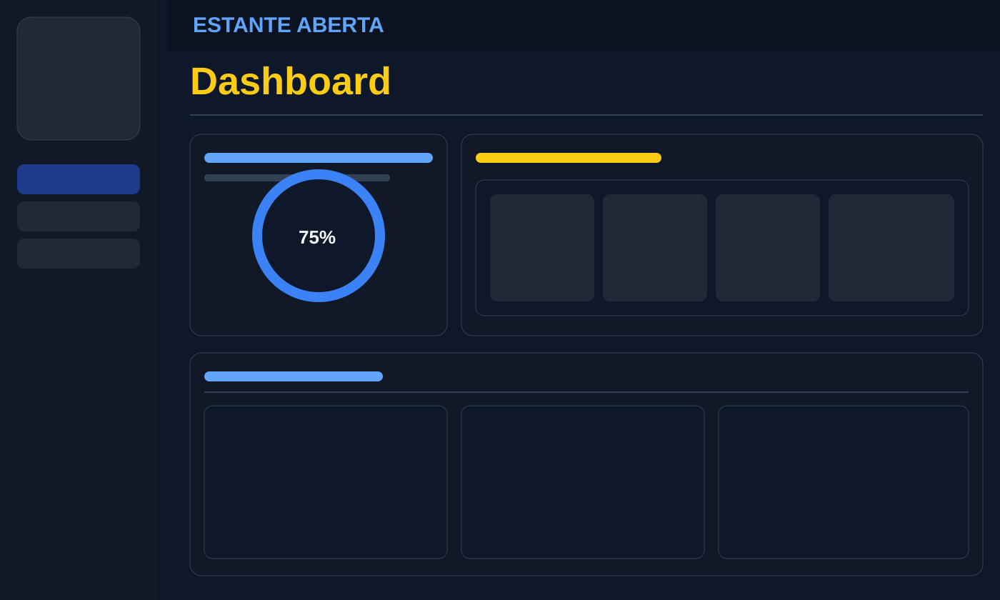
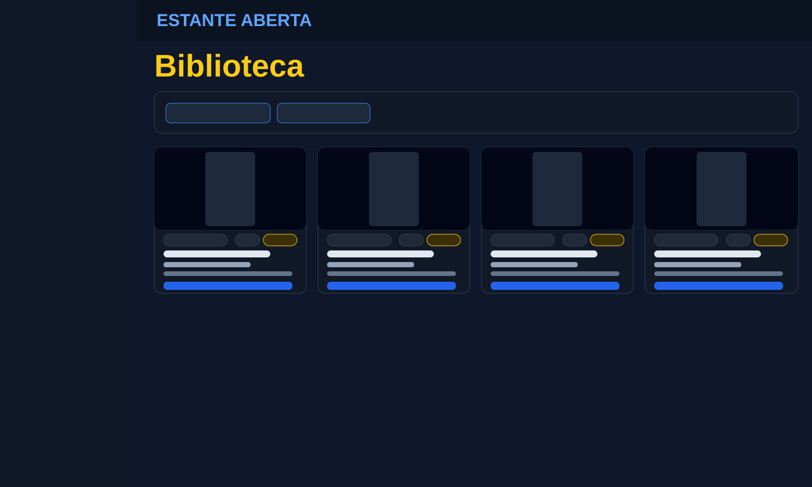

# EstanteAberta




Plataforma web para comunidade de leitura, com biblioteca interativa, resenhas, gamificacao por XP/medalhas e acompanhamento de metas pessoais.

## Proposta de Valor

O EstanteAberta combina experiencia visual moderna com features de engajamento:

- Catalogo de livros com filtros inteligentes e experiencia responsiva.
- Resenhas com notas para criar recomendacoes sociais.
- Metas e ofensiva diaria para incentivar consistencia de leitura.
- Progressao por XP e medalhas para gamificar a jornada.
- Tema dark/light com identidade visual consistente.

## Screenshots do Produto

Dashboard:



Biblioteca:



## Principais Funcionalidades

- Autenticacao de usuarios (cadastro, login, logout).
- Biblioteca com cards visuais, filtros por categoria e ano.
- Detalhes de livro com resenhas e notas.
- Cadastro de novos livros com upload de capa.
- Dashboard com destaques e ultimas resenhas.
- Metas anuais de leitura e meta de resenhas.
- Perfil com foto, XP, ofensiva e badges de nivel.

## Arquitetura

```text
ProjetoLeitura/
  leitura/                  # App principal: models, views, forms, templates
  literamatch_project/      # Configuracoes Django (settings, urls, wsgi/asgi)
  media/                    # Uploads locais (capas, badges, perfis)
  manage.py
```

## Stack Tecnica

- Backend: Django 6
- Linguagem: Python 3.13+
- Banco local: SQLite
- Frontend: Django Templates + Bootstrap + Bootstrap Icons
- Configuracao de ambiente: python-dotenv

## Setup Rapido (Local)

1. Clone o repositorio

```bash
git clone https://github.com/ViniciusModenese/ProjetoLeitura.git
cd ProjetoLeitura
```

2. Crie e ative o ambiente virtual

```bash
python -m venv venv
```

PowerShell (Windows):

```powershell
venv\Scripts\Activate.ps1
```

3. Instale dependencias

```bash
pip install django python-dotenv pillow
```

4. Configure variaveis de ambiente em `.env`

```env
SECRET_KEY='sua_chave_django_aqui'
DEBUG=True
```

5. Rode migracoes

```bash
python manage.py migrate
```

6. Execute o projeto

```bash
python manage.py runserver
```

App: http://127.0.0.1:8000/

Admin: http://127.0.0.1:8000/admin/

## Rotas de Negocio

- `/` - Dashboard
- `/biblioteca/` - Catalogo de livros
- `/livro/<id>/` - Detalhes + resenhas
- `/livros/novo/` - Cadastro de livro
- `/metas/` - Painel de metas
- `/perfil/` - Perfil e progressao

## Qualidade e Seguranca

- `.env`, `db.sqlite3`, `media/` e `scripts/` ignorados no versionamento.
- SECRET_KEY consumida via variavel de ambiente.
- Testes automatizados disponiveis via Django test runner.

Executar testes:

```bash
python manage.py test
```

## Roadmap

- Melhorar recomendacao de livros por perfil de leitura.
- Adicionar paginacao e ordenacao avancada na biblioteca.
- Exportar relatorios de metas e progresso.
- Pipeline CI para testes e validacoes automaticas.

## Licenca

Projeto academico. Ajuste a licenca conforme necessidade de publicacao oficial.
